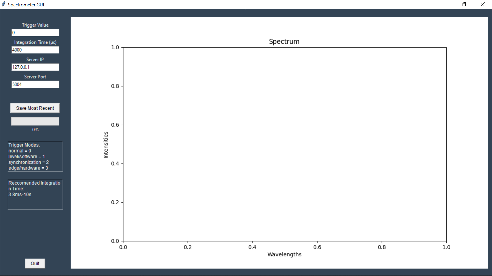

# UDP Multicast Server for OceanInsight Spectrometer

UDP multicast server for sending spectrometer data. Spectrometer settings can be set from client side.

## Instructions

1. Run main_client.py to send over parameters.
2. Run main_server.py to receive parameters. Then everything else should run smoothly.
